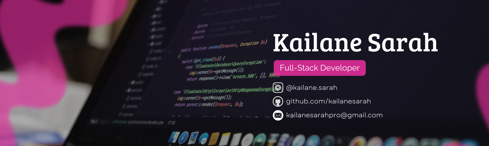

<!DOCTYPE html>
<html>
<head>
</head>
<body>
  
  ###Sobre
  

    Olá, tudo bem? 😊 Sou a Kailane, e meu objetivo é desenvolver soluções rápidas e inovadoras com tecnologia.
    Atualmente, estou cursando Ciências da Computação no Instituto Federal do Ceará (IFCE) e sou apaixonada por programação e resolução de problemas.
    ✍️ Minha trajetória profissional inclui experiências diversificadas, desde marketing até desenvolvimento web. Atuei como redatora, analista de mídias sociais, copywriter, designer gráfico e desenvolvedora WordPress 🌐.
    Sim, sou publicitária, uma das minhas grandes paixões. E a curiosidade é o que me move, decidi seguir um novo caminho e estou estudando e me aprofundando em programação, desenvolvimento web.
    Vamos criar conexões e crescer juntos! Me siga nas redes sociais. 😊

 

  ###Atualmente, estou ampliando meu conhecimento em tecnologias modernas, incluindo:
  <section>
    
  </section>
  <section>
    
  </section>
  <section>
      
  </section>
  
  <section>
    
  </section>

 
 

<section>
  ###💻 Minhas principais habilidades incluem:

---->Frontend: Criação de interfaces intuitivas e responsivas com HTML, CSS, e React.

---->Backend: Desenvolvimento de APIs e serviços robustos utilizando Express e gerenciamento de banco de dados com MySQL.

---->Integração de Sistemas: Conexão e integração de frontend e backend para garantir um fluxo de dados coeso.

</section>

 
 

<section>
###🚀 O que me motiva? 
  
Continuar aprendendo e enfrentando novos desafios técnicos. Estou sempre em busca de oportunidades para aplicar minhas habilidades e colaborar em projetos inovadores.

</section>
 
 
<section>
  ###📬 Vamos Conectar!
  
Se você estiver interessado em colaborar ou discutir oportunidades que se alinhem com minhas habilidades e interesses, entre em contato!

 
 
<section>
  ###Me siga nas redes sociais:
  
Instagram: @kailane.sarah

  
Linkedin: www.linkedin.com/in/kailane-sarah

</section>
</body>
</html>
